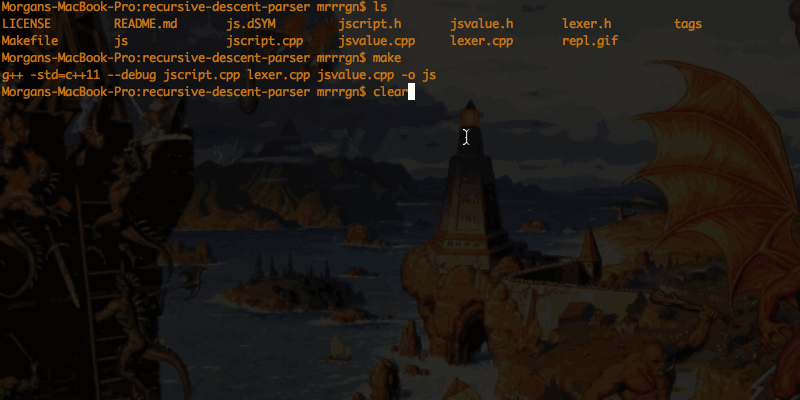

Jouet Script
============

A toy programming language with JavaScript inspired syntax. It's pretty poorly written, but a fun way to learn C++ and the pitfalls of language development. The project is very simple and hopefully easy to follow.

Everything in this language is hand written. It's very basic and standard: recursive descent parser, mark and sweep garbage collector, and syntax directed interpreter (no AST).

</img>

---

Lexer.cpp:
Reads characters, one at a time, from an internal buffer and emits tokens as soon as a match appears. Contains many convenience functions for moving forward and backward in the token stream. Also includes a method which produces custom errors annotated with a column/line number.

JSValue.cpp:
Every value in the language is a JSValue, this includes strings, integers, functions, objects, arrays, etc... This file also includes JSContext: an object which stores scopes and the global value cache, used in garbage collection, and JSValueHandle: a simple container used to point back at JSValues with a name. These are stored in scopes, think of them as links or variables.

JScript.cpp:
The parser, interpreter, and repl live here.
